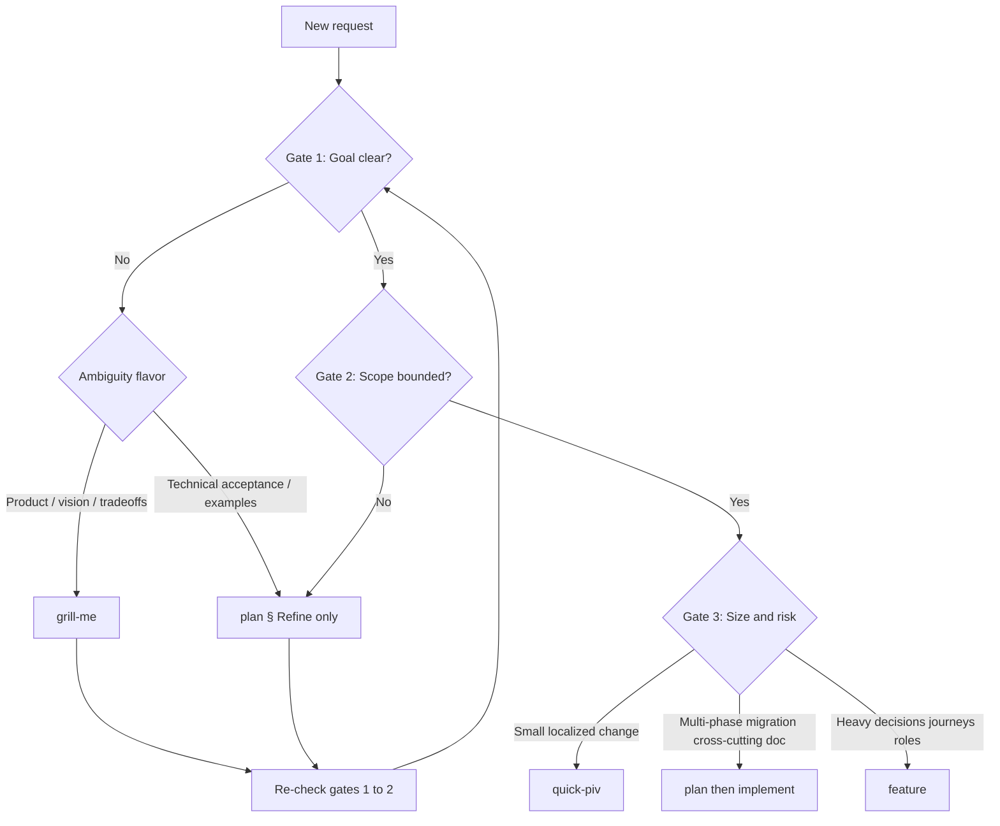

# Skill router

Use this file to pick **one primary skill** (sometimes two in sequence).

**Invocation contract (always):** After you decide the primary skill — and any secondary skill that must run **next** in order — **read that skill’s `SKILL.md` and execute its workflow starting in this same turn.** Invoking means load + follow steps, not naming a path or asking the user which skill file to open. If two skills apply sequentially (for example `plan` → `implement`), finish the first’s applicable step or hand off explicitly per that skill, then read and run the second without ending on a static routing table alone.

**Bare `/router`:** If the user message is only `/router` (optional whitespace) and carries **no substantive task or question**, the primary skill is **finish** — read `.agents/skills/finish/SKILL.md` immediately and run it on the current working tree.

**Quality bar:** Listed skills were reviewed for actionable structure (clear triggers, steps, or rubrics). Very thin prompts (e.g. `stepback`) are called out as minimal.

---

## Decision model: goals + requirements → skill

Route work in **three gates**. Answer in order; **do not skip gate 1 or 2** to reach `plan` or `implement`.

### Gate 1 — Goal / outcome

**Question:** Can you state what “done” means in one sentence, with something verifiable (demo, test, or checklist)?

| State | Meaning |
|-------|---------|
| **Clear** | Intended behavior or artifact is agreed; success is falsifiable. |
| **Unclear** | Wish or direction only; conflicting interpretations possible; “make it better” with no bar. |

If unclear, ask about the user's intended app usage, product vision, priorities, or real user journey. **First read** `documentation/DOC_APP_VISION.md` when it may already answer “who / why / what the app is for”; if it is still **`DRAFT`**, route the user to complete it (`.agents/skills/start/SKILL.md` § App vision) or treat lack of vision as ambiguity until they defer in writing. Do not route into full planning until the answer removes ambiguity.

### Gate 2 — Scope / requirements

**Question:** Is **in-scope vs out-of-scope** explicit enough to choose layers and files without inventing product scope?

| State | Meaning |
|-------|---------|
| **Bounded** | Boundaries, constraints, and “not doing X” are understood (or intentionally left open **only** where documented). |
| **Unbounded** | Missing acceptance hints, unknown data/auth/API shape, or “everything flexible.” |

If the emerging direction would diverge from industry standards, framework best practices, or established repo conventions, ask whether the diversion is intentional or whether to align with best practices before routing to implementation.

### Gate 3 — Delivery shape (only after gates 1–2 pass)

**Question:** How big and how risky is the **engineering** change?

| Signal | Typical skill |
|--------|----------------|
| Single area, few files, no migration / no breaking API | `quick-piv` |
| Multiple phases, migrations, cross-cutting rules, or durable handoff doc | `plan` → `implement` |
| Dense product decisions, journeys, roles, explicit approval checkpoints | `feature` |

### Clarification-first routing (gate 1 or 2 fails)

**Do not open `DEVELOPMENT_PLAN.md` yet.** Pick by **what is missing**:

| Missing | Prefer |
|---------|--------|
| Vision, priorities, tradeoffs, UX intent | `.agents/skills/grill-me/SKILL.md`; ask app-usage questions until ambiguity is removed |
| Concrete behavior, APIs, data, acceptance examples | Follow **Refine** in `.agents/skills/plan/SKILL.md` (questions and tables there — stop before **Investigate** until gates pass); frame questions around the user's intended app usage when product meaning is unclear |
| You lack repo grounding while clarifying | `.agents/skills/prime/SKILL.md` **before or mixed with** clarification |

After gates 1–2 pass, **re-run** the flowchart from the top (especially if the user changed scope).

### Matrix (compact)

Rows = gate 1–2; columns = gate 3 applies only when both are **Clear / Bounded**.

| Goal | Scope | Next step |
|------|-------|-----------|
| Unclear | any | Clarify (`grill-me` and/or `plan` § Refine); optional `prime` |
| Clear | Unbounded | Bound scope (`plan` § Refine); optional `prime` |
| Clear | Bounded | Use flowchart below for `quick-piv` vs `plan` vs `feature` |

### Flowchart

Optional: run **`prime`** once when the codebase or branch context is unfamiliar — it does not replace gates 1–2.

---

## Situation → skill

### This repo — workflow & delivery

| Situation | Skill |
|-----------|--------|
| User sends **only** `/router` (no substantive task); see **Bare `/router`** above | `.agents/skills/finish/SKILL.md` |
| New chat / ambiguous task; map repo rules and recent git state | `.agents/skills/prime/SKILL.md` |
| **Goal and scope clear**; non-trivial job needing phased written plan + compliance | `.agents/skills/plan/SKILL.md` |
| Goal or scope **not** ready — questions only, no plan file yet | `.agents/skills/grill-me/SKILL.md` and/or `.agents/skills/plan/SKILL.md` **§ Refine** (see Decision model above) |
| Execute an existing `DEVELOPMENT_PLAN.md` phase by phase | `.agents/skills/implement/SKILL.md` |
| Small scoped change; plan+implement+validate in one pass | `.agents/skills/quick-piv/SKILL.md` |
| Review plan or implementation **without** editing by default | `.agents/skills/validate/SKILL.md` |
| Pre-merge / post-refactor architecture & quality gate (layer semantics + tooling) | `.agents/skills/check/SKILL.md` |
| Component-level rubric (props, MUI, a11y, tests) | `.agents/skills/review/SKILL.md` |
| Version, changelog, staging gate, **local** commit | `.agents/skills/finish/SKILL.md` |
| Push already committed work (after `finish`) | `.agents/skills/push/SKILL.md` |
| Human onboarding; README quick start | `.agents/skills/start/SKILL.md` (includes **App vision** gate → `documentation/DOC_APP_VISION.md`) |
| Remove setup wizard after app is configured | `.agents/skills/complete-setup/SKILL.md` |

### This repo — product & codebase shape

| Situation | Skill |
|-----------|--------|
| Full feature request with mandatory decision stops and phased spec | `.agents/skills/feature/SKILL.md` |
| Scientific debugging; hypotheses; user supplies runtime evidence | `.agents/skills/debug/SKILL.md` |
| Stress-test product/design choices before implementation | `.agents/skills/grill-me/SKILL.md` |
| Simplify **one** concrete feature (flows + code), reduce steps/complexity | `.agents/skills/challenge/SKILL.md` |
| Find cross-feature duplication and consolidation candidates | `.agents/skills/consolidate/SKILL.md` |
| Optimize hotspots: design → approach → efficiency → complexity | `.agents/skills/optimize2/SKILL.md` |
| Semantic architecture repair **after** automated checks pass | `.agents/skills/architecture-repair2/SKILL.md` |
| Retro from failures/diffs; persist lessons into rules or skills | `.agents/skills/learn/SKILL.md` |
| Tighten prose/structure of an appended rule draft | `.agents/skills/improve-rule/SKILL.md` |
| Score quality of an attached rule/command with rubric | `.agents/skills/grade-rule/SKILL.md` |
| Brief reflection: problem, attempts, wider alternative | `.agents/skills/stepback/SKILL.md` *(minimal)* |

### This repo — integrations

| Situation | Skill |
|-----------|--------|
| Airtable Meta/schema (`tbl…` / `fld…`), no row payloads | `.agents/skills/airtable-schema-structure/SKILL.md` |
| Sample Airtable rows / cell shapes **after** schema known | `.agents/skills/airtable-data-sample/SKILL.md` |

### User-level Cursor skills (`~/.cursor/skills-cursor/`)

| Situation | Skill |
|-----------|--------|
| Author or refactor Agent Skills (`SKILL.md`) | `~/.cursor/skills-cursor/create-skill/SKILL.md` |
| Migrate `.mdc` rules / slash commands → skills | `~/.cursor/skills-cursor/migrate-to-skills/SKILL.md` |
| Create `.cursor/rules` `.mdc` guidance | `~/.cursor/skills-cursor/create-rule/SKILL.md` |
| Cursor hooks (`hooks.json`, hook scripts) | `~/.cursor/skills-cursor/create-hook/SKILL.md` |
| Custom subagents | `~/.cursor/skills-cursor/create-subagent/SKILL.md` |
| PR merge-ready loop (comments, conflicts, CI) | `~/.cursor/skills-cursor/babysit/SKILL.md` |
| Split work into small PRs | `~/.cursor/skills-cursor/split-to-prs/SKILL.md` |
| Standalone analytical UI artifact (`.canvas.tsx`) | `~/.cursor/skills-cursor/canvas/SKILL.md` |
| IDE `settings.json` | `~/.cursor/skills-cursor/update-cursor-settings/SKILL.md` |
| CLI `~/.cursor/cli-config.json` | `~/.cursor/skills-cursor/update-cli-config/SKILL.md` |
| CLI status line | `~/.cursor/skills-cursor/statusline/SKILL.md` |
| User typed `/shell` — run remainder literally | `~/.cursor/skills-cursor/shell/SKILL.md` |

### Plugin skills (paths vary by install; discover under `~/.cursor/plugins/`)

| Situation | Skill (name) |
|-----------|----------------|
| Any Supabase product (Auth, DB, Edge, Realtime, Storage, MCP, migrations) | `supabase` |
| Postgres query/schema performance, pooling, RLS performance | `supabase-postgres-best-practices` |
| Cloudflare platform routing (“what product do I use?”) | `cloudflare` |
| Wrangler CLI commands and config | `wrangler` |
| Workers code author/review, anti-patterns | `workers-best-practices` |
| Durable Objects design/review | `durable-objects` |
| Agents SDK reference-heavy agent work | `agents-sdk` |
| Generate/deploy AI agent app on Cloudflare | `building-ai-agent-on-cloudflare` |
| Remote MCP server on Workers | `building-mcp-server-on-cloudflare` |
| Untrusted code execution / sandbox | `sandbox-sdk` |
| Core Web Vitals / Lighthouse-style audit (Chrome DevTools MCP) | `web-perf` |

---

## When more than one skill seems relevant

Choose by **primary outcome** (what must be true when done). If two outcomes are required, run skills **in order** (e.g. plan → implement → validate → finish). Use **Decision model** above first: neither `plan` nor `feature` should start until gates 1–2 pass (unless you are intentionally only running **`plan` § Refine** or **`grill-me`**).

### `plan` vs `feature`

- **`plan`:** Engineering execution plan (`DEVELOPMENT_PLAN.md`, phases, gates, repo compliance). Use when gates 1–2 are **Clear / Bounded** and the gap is **structured implementation**, not discovery of what to build.
- **`feature`:** Deep product/requirements process with **mandatory user decision stops** and journey mapping. Use when gate 3 calls for **high decision density** (roles, journeys, approvals) even though gates 1–2 may be partly filled as you go — still clarify unknowns early within that skill, especially app-usage ambiguity and intentional standards diversions.

### `plan` vs `quick-piv`

- **`quick-piv`:** Single pass; chat-sized plan OK; small scope.
- **`plan`:** Multi-phase, migrations, breaking changes, or anything needing a durable plan file others can follow.

### `validate` vs `check`

- **`validate`:** Plan-only review **or** impl vs plan + default read-only tooling report; asks user before fixes.
- **`check`:** Merge/finish gate emphasizing **layer semantics** and architecture spot-checks on a scope/diff. Use when **structural correctness** is the worry.

### `check` vs `architecture-repair2`

- **`check`:** Routine gate on current scope (scripts + checklist).
- **`architecture-repair2`:** After linters pass — **semantic** placement, duplication, cross-feature boundaries, refactoring impact.

### `consolidate` vs `optimize2`

- **`consolidate`:** **Repo-wide** redundancy audit and prioritization (discovery of shared patterns).
- **`optimize2`:** **Targeted** optimization at four levels for chosen code; Rule of Three for extractions. Use for **hot paths** or known-complex modules.

### `consolidate` vs `architecture-repair2`

- **`consolidate`:** “What repeats?” → unify abstractly (may stay duplicated by decision).
- **`architecture-repair2`:** “Is code in the **wrong** layer/feature?” → move/refactor for boundaries.

### `challenge` vs `optimize2`

- **`challenge`:** Question whether the **feature or workflow** should exist or be simpler (remove/merge steps).
- **`optimize2`:** Improve existing code **without** necessarily changing product scope.

### `debug` vs `learn`

- **`debug`:** Active incident; hypotheses; runtime evidence; possibly temporary instrumentation.
- **`learn`:** After resolution or struggle — **capture durable** rule/skill/debug-pattern updates.

### `improve-rule` vs `learn`

- **`improve-rule`:** Style/clarity pass on **provided rule text**.
- **`learn`:** Decide **where** lessons live (rules vs skills vs debug appendix) from incident context.

### `grade-rule` vs `review`

- **`grade-rule`:** Grade **rules/commands** with command-quality rubric.
- **`review`:** Score **React/MUI components** with component rubric.

### `grill-me` vs `plan`

- **`grill-me`:** Product/design **Q&A** until shared understanding (questions first). Fits **gate 1** failures dominated by vision and tradeoffs.
- **`plan`:** **`§ Refine`** for engineering-level clarification (**gates 1–2**); full **`plan`** only after both pass — then produce **implementation document**.

### `prime` vs `start`

- **`prime`:** Agent loads **technical** context for implementation.
- **`start`:** Human **first-time setup** walkthrough.

### `finish` vs `push`

- **`finish`:** Commit-ready locally (version, changelog, staging rules).
- **`push`:** Remote sync only **after** commits exist; never commit inside push.

### `canvas` vs `validate` / reporting

- **`canvas`:** Standalone **visual artifact** (tables, timelines, rich layouts) as deliverable.
- **`validate`:** Structured **text report**; default no edits.

### Airtable: `airtable-schema-structure` vs `airtable-data-sample`

- Always **schema first**, **samples second** (skill body states this explicitly).

### Supabase: `supabase` vs `supabase-postgres-best-practices`

- **`supabase`:** Product workflows, Auth, RLS correctness, CLI/MCP, migrations narrative.
- **`supabase-postgres-best-practices`:** **Performance** tuning, query plans, indexing, pooling — narrow DB optimization.

### Cloudflare: `cloudflare` vs `wrangler` vs `workers-best-practices`

- **`cloudflare`:** Pick **product** (Workers vs Pages vs DO vs R2…).
- **`wrangler`:** **CLI** syntax and deploy/dev workflow.
- **`workers-best-practices`:** **Code/config review** against current Workers guidance.

### Cloudflare agents: `agents-sdk` vs `building-ai-agent-on-cloudflare`

- **`agents-sdk`:** Reference-led SDK usage (state, RPC, docs fetch).
- **`building-ai-agent-on-cloudflare`:** End-to-end **generated** agent app and deployment narrative.

### `building-mcp-server-on-cloudflare` vs `agents-sdk` (MCP sections)

- **`building-mcp-server-on-cloudflare`:** **Expose** tools as remote MCP with OAuth/deploy.
- **`agents-sdk`:** **Consume** or embed MCP patterns inside Agents SDK — use when agent wiring dominates.

### `web-perf` vs `optimize2`

- **`web-perf`:** **Browser-measured** performance (CWVs, network, traces via DevTools MCP).
- **`optimize2`:** **Code-level** structure and complexity optimization (may include perf but not Lighthouse-centric).

---

## Skill index (paths)

### Project (this repo)

- `.agents/skills/router/SKILL.md` — this file
- `documentation/DOC_APP_VISION.md` — product SSOT (problem, persona, app’s role)
- `.agents/skills/plan/SKILL.md`
- `.agents/skills/implement/SKILL.md`
- `.agents/skills/validate/SKILL.md`
- `.agents/skills/check/SKILL.md`
- `.agents/skills/consolidate/SKILL.md`
- `.agents/skills/review/SKILL.md`
- `.agents/skills/finish/SKILL.md`
- `.agents/skills/push/SKILL.md`
- `.agents/skills/quick-piv/SKILL.md`
- `.agents/skills/prime/SKILL.md`
- `.agents/skills/start/SKILL.md`
- `.agents/skills/complete-setup/SKILL.md`
- `.agents/skills/learn/SKILL.md`
- `.agents/skills/challenge/SKILL.md`
- `.agents/skills/feature/SKILL.md`
- `.agents/skills/debug/SKILL.md`
- `.agents/skills/grade-rule/SKILL.md`
- `.agents/skills/improve-rule/SKILL.md`
- `.agents/skills/architecture-repair2/SKILL.md`
- `.agents/skills/optimize2/SKILL.md`
- `.agents/skills/stepback/SKILL.md`
- `.agents/skills/airtable-schema-structure/SKILL.md`
- `.agents/skills/airtable-data-sample/SKILL.md`
- `.agents/skills/grill-me/SKILL.md`

### User Cursor bundle (`~/.cursor/skills-cursor/`)

- `create-skill`, `migrate-to-skills`, `create-rule`, `create-hook`, `create-subagent`, `babysit`, `split-to-prs`, `canvas`, `update-cursor-settings`, `update-cli-config`, `statusline`, `shell` — each under its own folder `SKILL.md`.

### Plugins

Resolve paths via workspace MCP descriptors or `~/.cursor/plugins/cache/` — skill names: `supabase`, `supabase-postgres-best-practices`, `cloudflare`, `wrangler`, `workers-best-practices`, `durable-objects`, `agents-sdk`, `building-ai-agent-on-cloudflare`, `building-mcp-server-on-cloudflare`, `sandbox-sdk`, `web-perf`.

---

## Not present in this workspace

The agent inventory may list skills that are **not** checked into this repo (e.g. generic architecture/TDD/issue PRD skills). If absent on disk, substitute **`plan` / `consolidate` / `check`** or add a project skill before relying on them.
