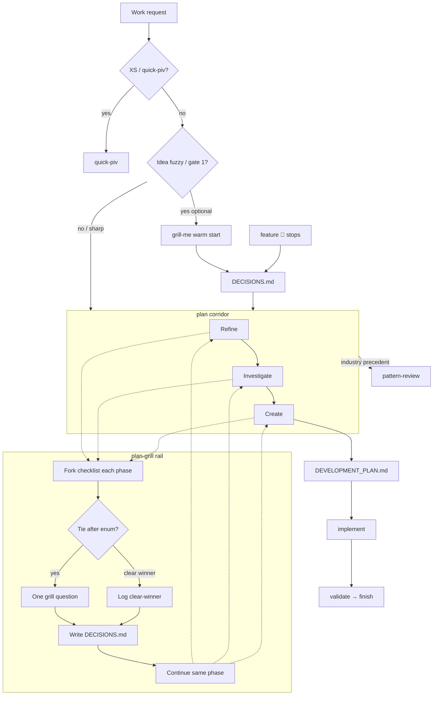

# Skill relationship flow (router sidecar)

**SSOT** for the grill → plan corridor → ship relationship diagram.  
`router` and `improve-skill-library` **link here** — do not duplicate a second mermaid elsewhere.

**Owner:** `.agents/skills/router/references/skill-relationship-flow.md`  
**Maintainers:** update when skills are added/removed/renamed, or when handoffs between `grill-me` / `plan-grill` / `plan` / `feature` / `pattern-review` / `quick-piv` change.  
**Checked on every** `/improve-skill-library` run (Phase 0 need-check → Phase 7 update if stale).

Optional IDE canvas (not repo SSOT): Cursor `canvases/plan-grill-flow.canvas.tsx` may mirror this; prefer editing **this file** first.

---

## Plan corridor + plan-grill rail

### Read rules

| Piece | Meaning |
|-------|---------|
| **grill-me** | Optional feeder into the ledger **before** the corridor |
| **plan-grill rail** | Beside **every** corridor phase — not a Create-only child |
| **Loop** | ask → write `DECISIONS.md` → **continue the same phase** |
| **DECISIONS.md** | Product/scope locks |
| **DEVELOPMENT_PLAN.md** | How to build |
| **pattern-review** | Industry precedent side door |
| **quick-piv** | No plan-grill |

Checklist/cues SSOT: [`.agents/skills/plan-grill/SKILL.md`](../../plan-grill/SKILL.md).  
Prose routing: [router § Plan corridor flow](../SKILL.md).

---

## Stale-check criteria (`improve-skill-library`)

Mark this file **needs update** when any of:

1. Skill added/removed/renamed that appears in the diagram or in router situation → skill for clarify/plan.
2. Handoff change among `grill-me`, `plan-grill`, `plan`, `feature`, `pattern-review`, `quick-piv`, `implement`.
3. `DECISIONS.md` / corridor / rail semantics change in `plan-grill` or router § Plan corridor flow.
4. Composition lens finds a handoff edge in the live skill DAG that this mermaid omits or contradicts.

If none apply: record `skill-relationship-flow: current` in the reconcile summary and leave the file unchanged.
