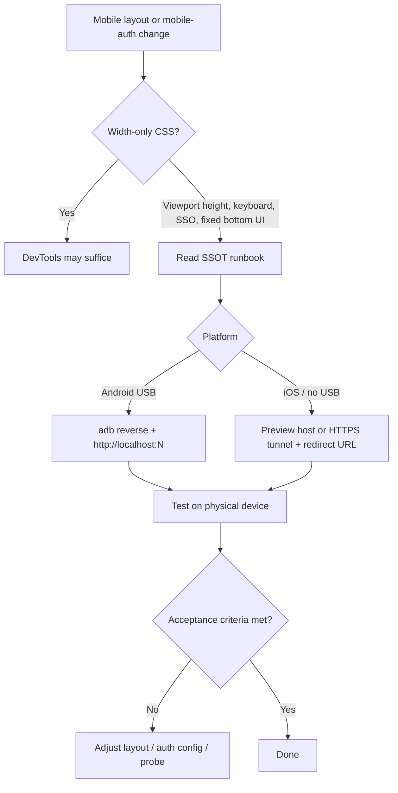

# Mobile local development (physical device) — cross-repo adoption guide

> **Reference implementation (MILA):** A Vite web app with staging Supabase auth (Google / Entree) where local dev on a **real phone** was required for layout and OAuth that DevTools cannot reproduce.  
> **SSOT runbook / procedure:** [`documentation/DOC_MOBILE_LOCAL_DEV.md`](../DOC_MOBILE_LOCAL_DEV.md) — full adb, tunnel, troubleshooting (this repo’s runbook; adapt port, IdP, and paths per §7).  
> **Layer model:** [`documentation/DOC_AGENT_WORKFLOW_LAYERS.md`](../DOC_AGENT_WORKFLOW_LAYERS.md)

---

## What it is / what it is not

| **It is** | **It is not** |
|-----------|----------------|
| A **portable doc pattern**: one runbook SSOT + links from setup, README, debug, and features | Instructions to copy another repo’s folder tree or preview URLs |
| **adb reverse + `http://localhost:N`** on Android when the IdP allows localhost redirects | A substitute for staging/production mobile QA |
| Clear **DevTools vs physical device** criteria so mobile bugs are not closed on emulator-only checks | The place to document viewport/CSS implementation (feature READMEs) |
| **IdP redirect constraints** (localhost vs LAN IP vs HTTPS tunnel) explained for adopters | Locked to one vendor — map tables to your auth provider |
| An **adoption guide** (this file) for agents porting the learning | A session handoff (git state, branch work) |

**One line:** *Document how to open local dev on a real device with working auth redirects — and treat that as the bar for mobile layout and mobile-login fixes.*

---

## 1. Problem this addresses

Chrome DevTools **device mode** is enough for width breakpoints. It is **not** enough for:

| Gap | Typical symptom |
|-----|-----------------|
| `100vh` vs visible viewport | Fixed bottom UI clipped below the fold on Android |
| System nav / gesture bar | Padding assumptions from `safe-area` fail |
| Virtual keyboard | `visualViewport` not reflected; composer hidden |
| Mobile OAuth | Login works on desktop localhost but fails on `http://192.168.x.x:N` |

**Process failure:** onboarding stops at “open localhost in desktop browser”; agents mark mobile tasks done after resizing Chrome only.

---

## 2. What to introduce in a repository

Four linked layers (generic names):

| Layer | Role |
|-------|------|
| **Runbook (SSOT)** | Single doc: DevTools vs device, Android, iOS, LAN limits, troubleshooting, when to update |
| **Setup hook** | One paragraph in setup/onboarding → link runbook |
| **Discoverability** | Root README doc index → one line |
| **Debug / agent pattern** | “DevTools OK on device broken” → link runbook; **no DevTools-only ship** for viewport/OAuth |
| **Feature pointers** (optional) | Per sensitive feature: link runbook + name layout code paths — **do not** duplicate adb steps |

### 2.1 Runbook section outline (portable)

| Section | Answers |
|---------|---------|
| DevTools vs device | When desktop emulation suffices |
| Prerequisites | Install, env, dev URL, default port **N** |
| Android + USB | Developer mode, Platform Tools, `adb reverse tcp:N tcp:N`, open `http://localhost:N` on phone |
| iPhone / iPad | Staging/preview deploy, HTTPS tunnel + redirect allowlist, or password-only layout test |
| LAN IP (`--host`) | Which flows work (often UI only) vs SSO (often broken) |
| Surface-specific debug (optional) | Console snippet or file paths for worst fixed-bottom UI |
| Troubleshooting | Symptom → fix |
| When to update | Port, new auth provider, new layout SSOT |

### 2.2 Boundaries

| Use the runbook for | Use something else for |
|---------------------|------------------------|
| Reaching **local** dev on a phone | Implementing `dvh` / `visualViewport` hooks |
| Redirect URL strategy on device | Full backend/IdP project setup |
| Sign-off on mobile layout / mobile login | CI device farms |
| adb / tunnel / preview hosts | Production release checklist |

---

## 3. Illustrative wiring (home repository only)

> **Do not copy paths or URLs from this section into your repository.**  
> They show how one team wired the learning. Your package manager, port, preview host, and directories will differ.

### 3.1 Example file map

| Role | Example path (home repo) |
|------|--------------------------|
| **Runbook (SSOT)** | `documentation/DOC_MOBILE_LOCAL_DEV.md` |
| Setup cross-link | `documentation/SETUP_GUIDE.md` — § *Testing on a physical phone (optional)* |
| README index | `README.md` — *Mobile development (physical device)* |
| Agent debug pattern | `.cursor/skills/debug/patterns.md` — *Mobile layout OK in DevTools but broken on a real phone* |
| Chat layout code (one surface) | `src/features/chat/components/ChatContent/`, `src/shared/hooks/useMobileComposerBottomOffset.ts` |
| Chat feature pointer | `src/features/chat/README.md` |
| Job context (one instance) | `documentation/jobs/agent_job_mobile_friendly/` |
| This adoption guide | `documentation/handoffs/MOBILE_LOCAL_DEV_ADOPTION_GUIDE.md` |

### 3.2 Example integration (home repo)

| Stage | Example integration (home repo) |
|-------|----------------------------------|
| Human onboarding | Setup guide links SSOT runbook |
| Discovery | README lists runbook under documentation |
| Agent debugging | Debug patterns require physical device + link runbook |
| Feature work | Chat README links runbook + viewport files |
| Cross-repo port | This guide + `write-adoption-guide` skill (optional) |

**Principle:** adb steps and redirect rules exist **once** in the runbook; every other doc **links** it.

---

## 4. Portable substance

### 4.1 Android + USB (recommended for local SSO)

When the identity provider allows **`http://localhost`** but **rejects private LAN IPs** (common with Supabase-style redirect URL rules):

1. Start dev server on the PC on port **N**.
2. `adb reverse tcp:N tcp:N` (re-run after unplug/reboot).
3. On the phone browser: **`http://localhost:N`** — not `http://192.168.x.x:N` — for Google/Entree-style SSO to return correctly.

Install [Android Platform Tools](https://developer.android.com/tools/releases/platform-tools); verify `adb devices` shows `device` (not `unauthorized`).

### 4.2 iOS / no adb

| Approach | When to use |
|----------|-------------|
| **Preview / staging host** | Auth already configured; acceptable to test deployed builds |
| **HTTPS tunnel** (`localtunnel`, `ngrok`, Cloudflare Tunnel, …) | Local code + OAuth: add tunnel origin to IdP **Redirect URLs** |
| **Email/password on tunnel/staging** | Layout-only checks without SSO |

### 4.3 LAN IP and `--host`

`dev --host` helps share UI on Wi‑Fi **without** adb. Document explicitly: **SSO often fails** on LAN IP (IdP may redirect to configured Site URL instead).

### 4.4 Verification gate (humans and agents)

Before closing a mobile viewport or mobile-auth issue:

- [ ] Reproduced or verified on a **physical device** using the runbook URL pattern  
- [ ] Not accepted on DevTools-only or desktop resize-only evidence  

For layout fixes, prefer **`100dvh` / `100svh`** shell height and **`visualViewport`** offsets on fixed bottom UI where applicable.

### 4.5 Optional console probe

The home-repo SSOT includes a short browser-console script: compare `100vh` to `window.innerHeight` and whether a prompt textarea’s bottom exceeds the viewport (`clippedBelowPx > 0` ⇒ composer below fold).

**Adopters:** add one similar probe for your worst fixed-bottom control, or skip if not relevant.

---

## 5. Teaching example (one instance — home repository)

> **Illustrative only.** This story is not a spec for your repo. Reuse the *problem → verification → doc layers* pattern; do not copy file paths, hook names, job slugs, or URLs verbatim.

**Problem:** Chat composer appeared clipped on Android; DevTools at the same CSS width looked correct.

**Cause (pattern):** `100vh` larger than visible viewport; safe-area assumptions insufficient for 3-button navigation.

**Code response (your repo will differ):** shell/layout hooks on the chat surface (see §3 example paths).

**Verification response (portable):** `adb reverse` + `http://localhost:5173` per the SSOT runbook — not “responsive mode” in desktop Chrome.

**Doc response (portable):** runbook SSOT + debug pattern + feature README pointer — so the next agent does not re-discover adb/OAuth constraints.

---

## 6. Workflow (human and agent)

**Stop-the-line:** Do not ship or close mobile viewport/login defects on DevTools-only verification when the runbook requires a device.

---

## 7. How to adopt in another repository

### 7.1 Step-by-step

| Step | Action |
|------|--------|
| 1 | Create runbook from §2.1; set **your** dev command, port **N**, and auth project |
| 2 | Write Android section: USB debugging, `adb reverse`, phone URL |
| 3 | Write iOS section: preview URL and/or tunnel + IdP redirect admin steps |
| 4 | Add LAN IP table for **your** IdP (localhost vs private IP vs tunnel) |
| 5 | Link runbook from setup/onboarding (one paragraph) |
| 6 | Add one line to root README documentation list |
| 7 | Add debug/CONTRIBUTING or agent pattern: physical device required |
| 8 | For each mobile-critical feature: README line → runbook + layout code paths |
| 9 | Optional: copy this guide; copy `.agents/skills/write-adoption-guide/` and set `ADOPTION_GUIDE_OUTPUT_FOLDER` |

### 7.2 Minimum vs recommended

| Level | You get |
|-------|---------|
| **Minimum (humans)** | Runbook SSOT + setup link |
| **Recommended (agents)** | + README index + debug pattern + feature pointers + device verification gate |

### 7.3 Target repo discovery checklist

| Question | If missing |
|----------|------------|
| Default dev port **N** documented? | Add to prerequisites |
| Does SSO work on localhost but not LAN IP? | Document Android `adb reverse` path |
| iOS developers without USB? | Staging or tunnel section |
| Worst fixed-bottom UI identified? | Optional probe in runbook |
| Agents have a patterns/debug doc? | One mobile-device entry linking SSOT |
| Preview/staging URL for device tests? | Document under iOS section |

### 7.4 Illustrative mapping (home repo → your repo)

*Left column: examples from one implementation — not required names.*

| Example (home repo) | Your equivalent |
|---------------------|-----------------|
| `pnpm dev` / port `5173` | Your dev script / port **N** |
| Staging Supabase + `.env` | Your dev/staging backend + secrets file |
| `experimental--project-a13d8.web.app` | Your Firebase/Vercel/preview host |
| `DOC_MOBILE_LOCAL_DEV.md` | Your runbook path |
| `adb reverse tcp:5173 tcp:5173` | Same command, your **N** |
| Chat composer console probe | Your fixed-bottom control + selector |
| `.cursor/skills/debug/patterns.md` | `CONTRIBUTING.md`, `docs/debugging.md`, agent skill |

### 7.5 Adoption anti-patterns

- Duplicating adb/OAuth paragraphs in every feature README — **link** the runbook.
- Telling developers to use LAN IP for SSO without documenting IdP behavior.
- Closing mobile bugs after desktop Chrome device toolbar only.
- Copying another team’s preview URL into unrelated products.
- Runbook only in wiki/Notion — keep **in-repo** SSOT so agents can read it.

---

## 8. Edge cases

| Situation | Guidance |
|-----------|----------|
| Custom auth (non-Supabase) | Document localhost vs tunnel allowlist for **your** IdP |
| Expo / React Native | Use Metro/Expo docs — this learning targets **web in mobile browser** |
| Monorepo | One root runbook; table of ports per app |
| No Cursor / agents | Runbook + README minimum still applies |
| Corporate devices blocking USB debugging | Fall back to tunnel or staging (§4.2) |

---

## 9. Summary

Replicate **one mobile local-dev runbook (SSOT)** plus **thin links** from setup, README, debug patterns, and (where needed) feature READMEs. Portable core: **physical device required** for viewport/SSO issues; **Android `adb reverse` + localhost** when the IdP rejects LAN IPs; **tunnel or preview** for iOS or no-USB teams.

Full step-by-step procedure, troubleshooting, and the optional console probe live in the **SSOT runbook** linked in the purpose block — not duplicated here.

**To port to another repo:** draft your runbook from §2 and §7 using that SSOT as a reference; optionally copy this guide and the `write-adoption-guide` skill folder (`.agents/skills/write-adoption-guide/`).
