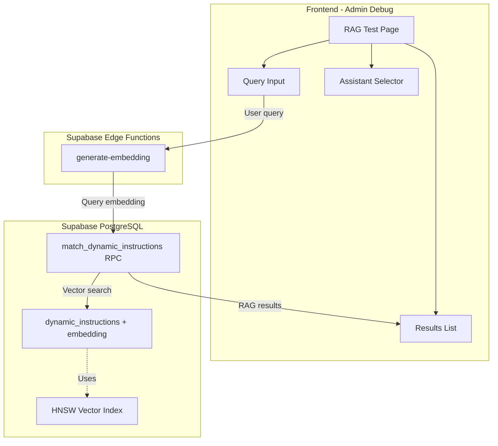

# RAG Testing Tool Implementation Plan

## Architecture Overview



---

## Phase 1: Database Infrastructure

### 1.1 Add Embedding Column

Add `embedding vector(384)` column to `dynamic_instructions` table:

```sql
-- Add embedding column (pgvector already installed v0.8.0)
ALTER TABLE dynamic_instructions
ADD COLUMN embedding extensions.vector(384);

-- Create HNSW index for fast similarity search
CREATE INDEX idx_dynamic_instructions_embedding 
ON dynamic_instructions 
USING hnsw (embedding vector_cosine_ops);
```

Location: `supabase/migrations/YYYYMMDD_rag_embedding_column.sql`

### 1.2 Create Semantic Search RPC Function

```sql
CREATE OR REPLACE FUNCTION match_dynamic_instructions (
  query_embedding extensions.vector(384),
  assistant_id_filter uuid,
  match_count int default 10
)
RETURNS TABLE (
  id uuid,
  key text,
  knowledge_key text,
  dynamic_prompt text,
  "order" integer,
  threshold numeric,
  similarity_score float,
  tags text[]
)
LANGUAGE sql
SECURITY DEFINER
AS $$
  SELECT 
    di.id,
    di.key,
    di.knowledge_key,
    di.dynamic_prompt,
    di."order",
    di.threshold,
    1.0 - (di.embedding <=> query_embedding) as similarity_score,
    di.tags
  FROM dynamic_instructions di
  INNER JOIN assistant_dynamic_instructions adi 
    ON di.id = adi.dynamic_instruction_id
  WHERE 
    adi.assistant_id = assistant_id_filter
    AND di.embedding IS NOT NULL
  ORDER BY di.embedding <=> query_embedding ASC
  LIMIT LEAST(match_count, 50);
$$;
```

---

## Phase 2: Edge Function for Embedding Generation

### 2.1 Create generate-embedding Edge Function

Location: `supabase/functions/generate-embedding/index.ts`

```typescript
import 'jsr:@supabase/functions-js/edge-runtime.d.ts'
import { corsHeaders } from '../_shared/cors.ts'

Deno.serve(async (req) => {
  if (req.method === 'OPTIONS') {
    return new Response('ok', { headers: corsHeaders })
  }

  if (req.method !== 'POST') {
    return new Response('Method not allowed', { status: 405, headers: corsHeaders })
  }

  const { text } = await req.json()
  
  if (!text || typeof text !== 'string') {
    return new Response(JSON.stringify({ error: 'text is required' }), { 
      status: 400, 
      headers: { ...corsHeaders, 'Content-Type': 'application/json' } 
    })
  }

  // Generate embedding using gte-small (built-in, 384 dimensions)
  const session = new Supabase.ai.Session('gte-small')
  const embedding = await session.run(text, {
    mean_pool: true,
    normalize: true
  })

  return new Response(JSON.stringify({ embedding }), {
    headers: { ...corsHeaders, 'Content-Type': 'application/json' }
  })
})
```

---

## Phase 3: Backfill Existing Embeddings

Create a one-time backfill script or Edge Function to generate embeddings for existing 18 dynamic instructions.

Option A: Admin action in RAG test page ("Generate Missing Embeddings" button)

Option B: SQL script calling Edge Function for each row

---

## Phase 4: Frontend RAG Test Page

### 4.1 Create RAG Service

Location: `src/shared/services/ragService.ts`

```typescript
export async function generateQueryEmbedding(text: string): Promise<number[]>
export async function findRelevantDynamicInstructions(
  embedding: number[],
  assistantId: string,
  matchCount?: number
): Promise<RAGResult[]>
export async function runRAGSearch(
  query: string,
  assistantId: string
): Promise<RAGSearchResult>
```

### 4.2 Create RAGTestPage Component

Location: `src/pages/admin/debug/components/RAGTestPage.tsx`

Simple UI:

- Text field for query input
- Dropdown to select assistant (from `useAssistants()`)
- "Run Search" button
- Results list showing:
  - Instruction key/name
  - Similarity score (0-1)
  - Threshold value
  - Whether it passes threshold (score >= threshold)
  - Truncated dynamic_prompt preview

### 4.3 Add Route and Navigation

Update [src/routes/index.tsx](src/routes/index.tsx):

```typescript
<Route path="debug/rag" element={<RAGTestPage />} />
```

Update [src/pages/admin/debug/components/DebugToolsPage.tsx](src/pages/admin/debug/components/DebugToolsPage.tsx):

Add a DebugToolCard for "RAG Test" that navigates to `/admin/debug/rag`

---

## File Structure

```
src/
├── pages/admin/debug/components/
│   ├── DebugToolsPage.tsx      (modify - add RAG card)
│   └── RAGTestPage.tsx         (new - simple test page)
├── shared/services/
│   └── ragService.ts           (new - RAG service functions)

supabase/
├── functions/
│   └── generate-embedding/
│       └── index.ts            (new - embedding Edge Function)
└── migrations/
    └── YYYYMMDD_rag_embedding_column.sql (new - DB setup)
```

---

## UI Mockup

```
┌─────────────────────────────────────────────────────┐
│  RAG Test                                           │
├─────────────────────────────────────────────────────┤
│                                                     │
│  Query:                                             │
│  ┌─────────────────────────────────────────────┐   │
│  │ Enter test query here...                     │   │
│  └─────────────────────────────────────────────┘   │
│                                                     │
│  Assistant: [ Select Assistant        ▼ ]          │
│                                                     │
│  [ Run Search ]                                     │
│                                                     │
├─────────────────────────────────────────────────────┤
│  Results (3 found):                                 │
│                                                     │
│  ┌─────────────────────────────────────────────┐   │
│  │ ✓ Image generation                           │   │
│  │   Score: 0.85 | Threshold: 0.5 | PASSES     │   │
│  │   "When generating images, always..."        │   │
│  └─────────────────────────────────────────────┘   │
│                                                     │
│  ┌─────────────────────────────────────────────┐   │
│  │ ✓ Presentation design                        │   │
│  │   Score: 0.72 | Threshold: 0.6 | PASSES     │   │
│  │   "For presentation requests..."             │   │
│  └─────────────────────────────────────────────┘   │
│                                                     │
│  ┌─────────────────────────────────────────────┐   │
│  │ ✗ Rubric design                              │   │
│  │   Score: 0.45 | Threshold: 0.5 | FAILS      │   │
│  │   "When creating rubrics..."                 │   │
│  └─────────────────────────────────────────────┘   │
└─────────────────────────────────────────────────────┘
```

---

## Implementation Order

1. Database migration (embedding column, HNSW index, RPC function)
2. Edge Function for embedding generation
3. Backfill embeddings for existing 18 instructions
4. RAG service functions in frontend
5. RAG test page UI component
6. Add navigation card and route